# LabNote — Design-Referenz für KI-gestützten Nachbau

Dieses Dokument beschreibt Aussehen, Struktur und Verhalten von **LabNote** vollständig — Ziel: Eine KI, der man dieses README gibt, kann daraus **exakt dasselbe visuelle Design** für eine andere App ableiten, ohne Rückfragen stellen zu müssen.

## Projekt

- **Was:** Geführte Experimentprotokoll-App für Schüler:innen (Naturwissenschaftsunterricht). Schritt-für-Schritt-Wizard von Fragestellung bis Ergebnis, PDF-Export, Kalenderübersicht, Profil mit Tier-Avataren.
- **Sprache:** Deutsch, Zielgruppe Kinder/Jugendliche.
- **Repo:** https://github.com/l23287/LabNote
- **Branch/PR:** `claude/install-frontend-design-skill-hfqkw6` → https://github.com/l23287/LabNote/pull/1
- **Stack:** React 19 + TypeScript + Vite + Tailwind CSS v4 + React Router v7. `lucide-react` für Icons, `jspdf` für PDF-Export, `@dnd-kit` für Drag&Drop. Datenhaltung aktuell `localStorage` (Backend-Migration auf Supabase geplant, siehe Repo).

## Design-Tokens (aus `src/index.css`)

```css
--font-display: "Baloo 2", "Plus Jakarta Sans", sans-serif;   /* Überschriften, rund/verspielt, font-weight 700–800 */
--font-sans: "Plus Jakarta Sans", sans-serif;                  /* Fließtext */

--color-bg: #0e1712;          /* Seitenhintergrund, fast schwarz mit Grünstich */
--color-bg-soft: #172319;     /* leicht helleres Schwarz-Grün, z.B. Chips/Badges */
--color-surface: #1e2f22;     /* Karten/Inputs-Hintergrund */
--color-surface-2: #27402d;   /* etwas hellere Fläche, z.B. inaktive Fortschrittsbalken */
--color-border: #35543c;      /* Kartenrahmen */

--color-primary: #4ade80;      /* Hauptgrün (Aktionen, aktive Zustände) */
--color-primary-dark: #16a34a;
--color-primary-soft: #1c3327; /* dezenter Chip-Hintergrund in Primary-Ton */
--color-accent: #a3e635;       /* Lime-Akzent, z.B. CTA-Button-Gradient */
--color-accent-dark: #65a30d;
--color-sun: #bef264;          /* dritter Grünton für Verläufe/Icons */
--color-danger: #f87171;       /* Löschen/Fehler/Logout */

--color-ink: #eef7f0;    /* Haupttextfarbe (fast weiß, leicht grünstichig) */
--color-muted: #a3c2ac;  /* Sekundärtext */
--color-muted-2: #7a9884; /* Tertiärtext, Meta-Infos */
```

**Grundprinzip der Farbwelt:** Sehr dunkles, fast schwarzes Grün als Basis, alle UI-Flächen sind minimal hellere Grüntöne davon (kein reines Grau/Schwarz), Akzente ausschließlich in einer Grün→Lime-Skala (kein Blau/Lila außer für den einen "in Arbeit"-Status, siehe unten). Wirkt wie "Labor bei Nacht" / Terrarium-Ästhetik.

**Typografie:** Baloo 2 (rundlich, kindgerecht, sehr fett) für alle `<h1>`/Titel, Plus Jakarta Sans für Fließtext/Labels. Große, fette Überschriften (`text-3xl` bis `text-4xl`, `font-extrabold`), Fließtext in `text-muted`, nie reines Weiß für Body-Text.

**Radien & Formen:** Extrem rund überall — Karten `rounded-3xl` (24px), Buttons/Inputs `rounded-2xl` (16px), kleine Icon-Badges `rounded-2xl`, Kreis-Buttons `rounded-full`. Keine scharfen Ecken im gesamten Interface.

**Buttons:**
- Primary: volle Breite, `h-14`, `rounded-2xl`, Verlauf `linear-gradient(135deg, var(--color-primary), var(--color-primary-dark))`, weißer Text, `box-shadow: 0 10px 25px rgba(74,222,128,0.25)` (grüner Glow-Schatten unter dem Button).
- Accent-Variante: gleicher Aufbau, aber `--color-accent → --color-accent-dark` Verlauf, für die auffälligste CTA (z.B. "Neues Protokoll" auf Home).
- Ghost/Text-Button: kein Hintergrund, `text-muted`, für sekundäre Aktionen ("Ich habe schon einen Account", "Später fortsetzen").
- Icon-Kreis-Buttons (Zurück, Suche, Zurück-Pfeile): `w-10 h-10 rounded-full bg-surface border border-border`.

**Layout-Grundgerüst:** `.app-shell` zentriert den gesamten Content, `max-width: 28rem` (Mobile-First, wächst über Breakpoints auf 40rem/48rem). Alle Screens `min-h-dvh`, seitliches Padding `px-6`. Unten fixe Pill-förmige Navigationsleiste (`rounded-[28px]`, `bg-surface/95`, `backdrop-blur`) mit 5 Icons, mittig ein erhöhter runder "+"-Button in Accent-Gradient.

**Ambient-Hintergrund (`BlobBackground`-Komponente):** Auf Onboarding/leeren Screens weiche, stark verschwommene (`blur(60px)`), niedrig-opake (`opacity: 0.45`) Farbkreise (`--color-primary`/`--color-accent`/`--color-sun`), die sanft schweben (`translateY` + `scale`-Loop, 9s). Erzeugt organisches Glühen im Hintergrund, ohne den Content zu stören.

**Status-Farbcodierung (wichtig, bewusste Ausnahme von "nur Grün"):** Fertige/eingereichte Protokolle sind grün (`ProtocolCard`-Icon-Kachel + Fortschrittsbalken in Grün-Verläufen). Protokolle "in Arbeit" (nicht abgeschlossen) sind stattdessen **dunkelblau** (`linear-gradient(135deg, #60a5fa, #1e3a8a)` für die Kachel, `linear-gradient(90deg, #60a5fa, #1d4ed8)` für den Balken) — bewusster Farbbruch, damit Unvollständigkeit sofort auffällt, ohne dass es wie ein Fehler/Warnung (rot) wirkt.

## Globale Komponenten (`src/components/`)

- **`PrimaryButton`**: siehe Button-Beschreibung oben, Varianten `solid` | `accent` | `ghost`.
- **`BottomNav`**: 5 Items (Home, Protokolle, "+", Kalender, Profil), aktives Item in `--color-primary`, inaktive in `--color-muted`. Der "+"-Button sitzt bündig in der Leiste (kein Überstand nach oben), größer als die anderen Icons, mit eigenem Grün-Glow-Schatten.
- **`ProtocolCard`**: Wiederverwendete Kachel für Protokolle (Home, Liste, Kalender). Icon-Kachel (Flask-Icon auf Farbverlauf) oben links, Datum-Chip oben rechts, zweizeiliger Titel, dünner Fortschrittsbalken unten mit Status-Text.
- **`WizardHeader`**: Zurück-Pfeil (Kreis-Button) + "Schritt X von Y" rechts, darunter ein Segmented-Progress-Balken (ein `div` pro Schritt, gefüllt = Grün-Verlauf, offen = `--color-surface-2`), darunter die Schritt-Überschrift in `font-display`.
- **`ImagePicker`**: Reihe von `w-20 h-20 rounded-2xl` Bild-Thumbnails + gestricheltes "Foto hinzufügen"-Feld (`border-dashed`).
- **`ErrorBoundary`**: Fängt Rendering-Fehler App-weit ab, zeigt einen einfachen Wiederherstellungs-Screen statt weißer Seite.

## Screens im Detail

Jeder Screenshot ist bei 390×844px (Mobile-Viewport) aufgenommen — das Referenz-Format für alle Layout-Entscheidungen.

### 1. Onboarding (`/`, `src/pages/Onboarding.tsx`)
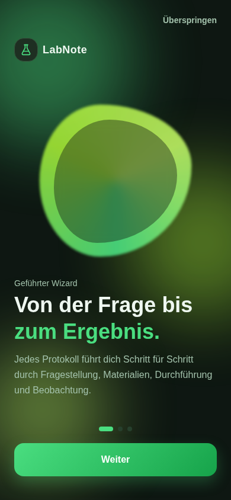
Willkommens-Screen vor dem Login. Logo (Flask-Icon-Badge + "LabNote") oben links. Zentral ein organisch geformter, leuchtender Grün-Verlauf-"Blob" mit innerem dunklem Ring (conic-gradient Rand + halbtransparenter dunkler Kern, `blob-float`-Animation). Darunter Eyebrow "Willkommen bei", zweizeilige `font-display`-Headline (erste Zeile weiß, zweite Zeile in `--color-primary`), Fließtext, dann zwei Buttons: Primary "Account erstellen", darunter Ghost-Button "Ich habe schon einen Account".

### 2. Login (`/anmelden`, `src/pages/Login.tsx`)
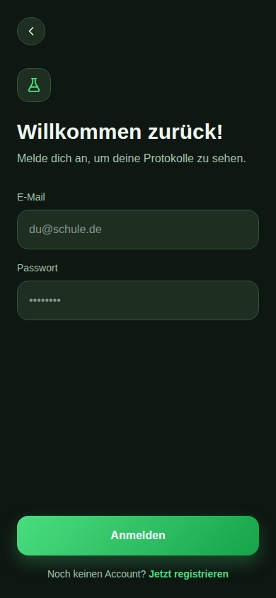
Zurück-Kreis-Button oben links, kleines Icon-Badge (Flask), Headline "Willkommen zurück!", Formular mit zwei Feldern (E-Mail, Passwort — beide `h-14 rounded-2xl bg-surface border border-border`), Primary-Button "Anmelden", darunter zentrierter Link "Jetzt registrieren".

### 3. Registrieren (`/registrieren`, `src/pages/Register.tsx`)
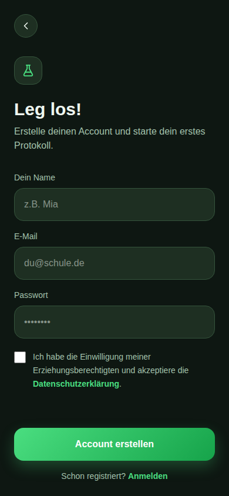
Gleiches Muster wie Login, zusätzliches Namensfeld, plus eine Einwilligungs-Checkbox ("Ich habe die Einwilligung meiner Erziehungsberechtigten…") mit Link zur Datenschutzerklärung vor dem Submit-Button.

### 4. Home (`/home`, `src/pages/Home.tsx`)
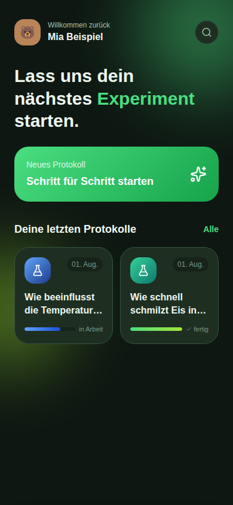
Header: Avatar (rundes Tier-Emoji auf Farbfläche) + "Willkommen zurück" + Name, rechts ein Kreis-Such-Button. Große dreizeilige Headline ("Lass uns dein nächstes / Experiment / starten." — mittleres Wort in Primary-Grün hervorgehoben). Darunter die große Accent-Gradient-CTA-Karte "Neues Protokoll — Schritt für Schritt starten" mit Sparkles-Icon. Darunter "Deine letzten Protokolle" + "Alle"-Link, dann ein 2-spaltiges Grid aus `ProtocolCard`s (siehe Statusfarben oben).

### 5. Protokoll-Liste (`/protokolle`, `src/pages/ProtocolList.tsx`)
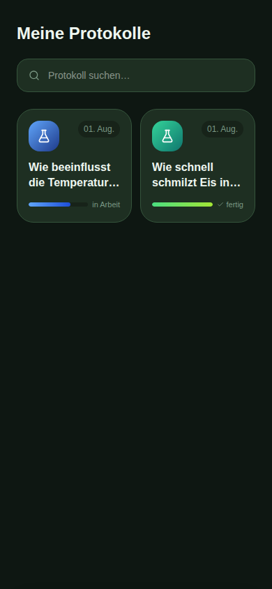
Headline "Meine Protokolle", darunter eine Such-Leiste (Icon + Input + Clear-Button, `h-12 rounded-2xl bg-surface`). Sucht per `startsWith` auf der Fragestellung, blendet nicht-passende Karten sofort aus. Darunter dasselbe `ProtocolCard`-Grid wie auf Home.

### 6. Kalender (`/kalender`, `src/pages/Calendar.tsx`)
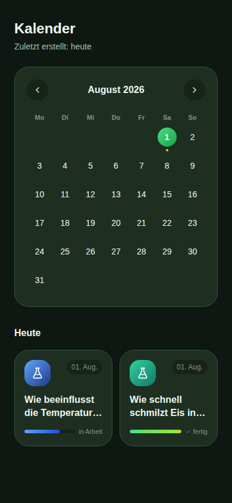
Headline + "Zuletzt erstellt: …"-Untertitel. Große abgerundete Kalenderkarte (`rounded-3xl bg-surface`): Monatsnavigation (Kreis-Pfeile links/rechts, Monat mittig fett), Wochentags-Kürzel, Tages-Grid — heutiger Tag mit grünem Ring, ausgewählter Tag mit gefülltem Grün-Verlauf-Kreis, Tage mit Protokoll bekommen einen kleinen grünen Punkt darunter. Darunter "Heute"/Datum-Überschrift + `ProtocolCard`-Grid für den gewählten Tag (angefangene Protokolle stehen zuerst).

### 7–13. Protokoll-Wizard (`/neu`, `src/pages/NewProtocolWizard.tsx`)
6 Schritte, jeweils `WizardHeader` oben (Segmented-Progress + Titel + Hinweistext), darunter das jeweilige Eingabefeld, unten ein Foto-Upload-Bereich (optional), ganz unten Primary-Button "Weiter" (bzw. "Zur Übersicht" im letzten Schritt) + Ghost-Button "Später fortsetzen & speichern" (speichert den Entwurf jederzeit und springt zu Home).

- Schritt 1 – Fragestellung (Textarea): 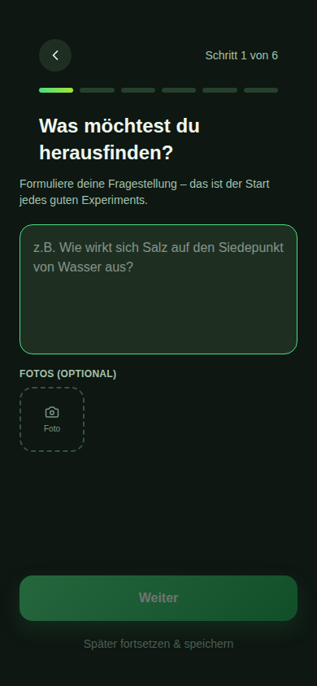
- Schritt 2 – Materialien (Text-Input + "+"-Button, Liste mit "×"-Entfernen-Buttons): 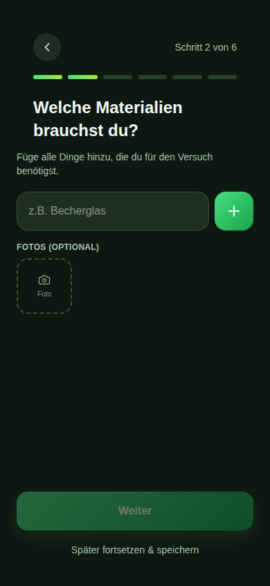
- Schritt 3 – Durchführung (Freitext-Textarea): 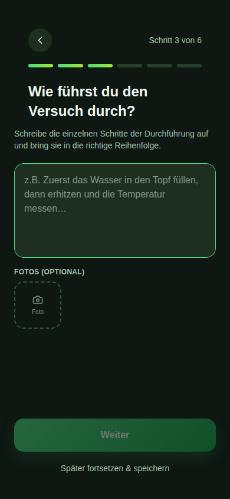
- Schritt 4 – Vermutung (Textarea, optional mit "Überspringen"-Link): 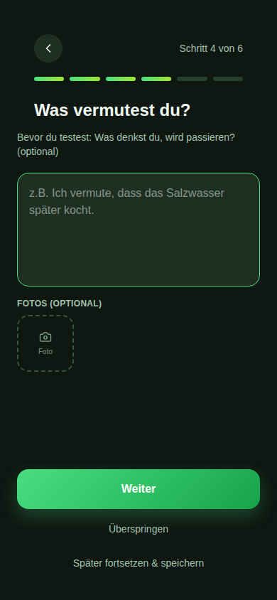
- Schritt 5 – Beobachtung (Textarea): 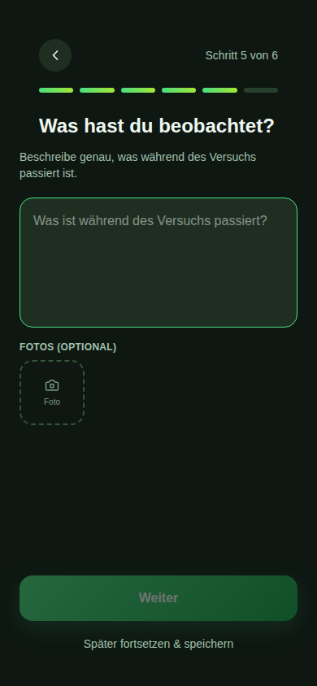
- Schritt 6 – Ergebnis (Textarea): 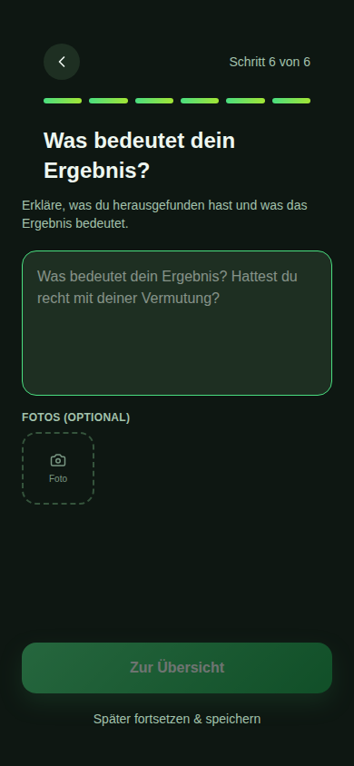
- Zusammenfassung: gestapelte Karten pro Abschnitt (Icon + Titel + Stift-Icon zum Bearbeiten), abschließender Primary-Button "Protokoll speichern": 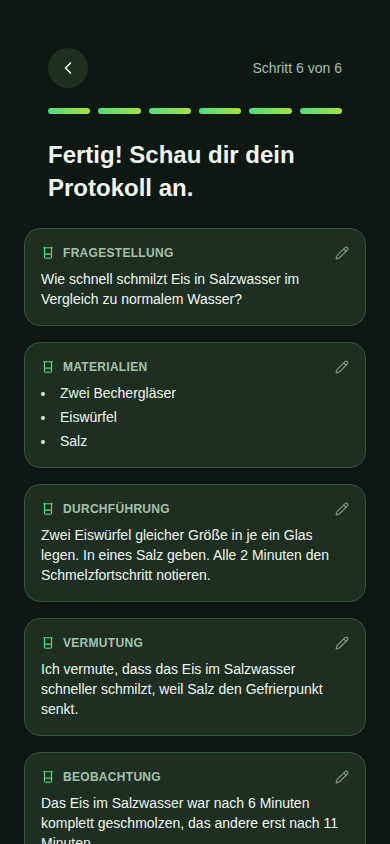

### 14. Protokoll-Detail (`/protokolle/:id`, `src/pages/ProtocolDetail.tsx`)
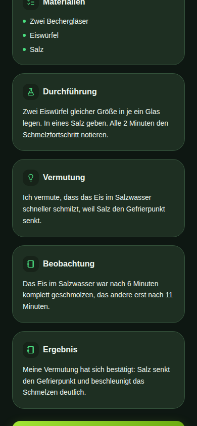
Kopfzeile: Zurück-Kreis-Button links, zwei Kreis-Buttons rechts (Bearbeiten, Löschen in Rot). Datum + große Fragestellung als Titel. Darunter gestapelte `Section`-Karten (Icon-Badge + Titel) für Materialien (Bullet-Liste), Durchführung (Fließtext), Vermutung/Beobachtung/Ergebnis. Unten zwei Buttons: Accent-Gradient "PDF erstellen & senden" (öffnet bei hinterlegter Lehrer-E-Mail automatisch einen `mailto:`-Entwurf), darunter Ghost-Button "PDF öffnen".

### 15. Profil (`/profil`, `src/pages/Profile.tsx`)
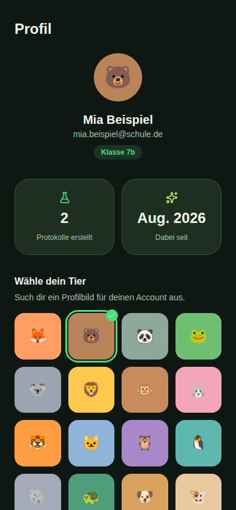
Zentrierter Avatar-Kreis (großes Tier-Emoji auf Farbfläche) + Name + E-Mail + Klassen-Chip. Zwei Stat-Kacheln nebeneinander (Anzahl Protokolle, "Dabei seit"). Darunter "Wähle dein Tier" — 3×6-Grid an Tier-Avataren zur Auswahl (ausgewähltes Tier mit grünem Rahmen + Häkchen-Badge). Zwei Eingabefelder mit Save-Button (Klasse, Lehrer-E-Mail). Darunter Datenschutz-Aktionen ("Meine Daten exportieren", "Konto löschen" in Rot) und "Abmelden".

### 16. Datenschutz (`/datenschutz`, `src/pages/Privacy.tsx`)
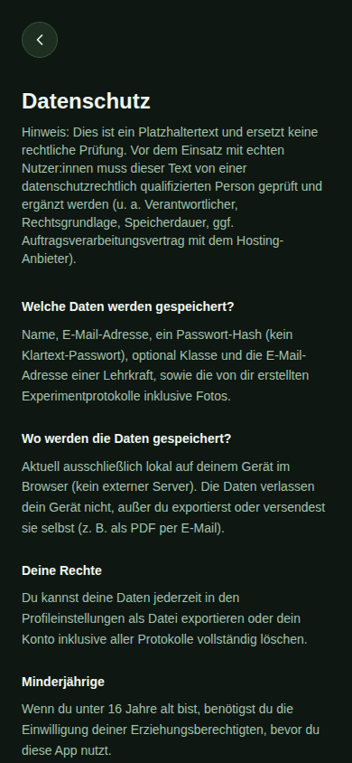
Einfache Textseite mit Zurück-Button, Headline, mehreren Abschnitten (Überschrift `font-display font-bold` + Fließtext in `text-muted`).

## Interaktionsmuster (für Verhaltens-Nachbau)

- **Formulare** sind immer `<form>` mit `type="button"` auf allen Nicht-Submit-Buttons (wichtiger Bugfix in diesem Projekt: fehlendes `type="button"` auf einem Zurück-Button im Formular löste versehentlich ein Submit aus).
- **Navigation "zurück zur Übersicht"** erfolgt immer über explizites `navigate("/home")`, nicht `navigate(-1)` (Browser-History ist bei mehrstufigen Flows unzuverlässig).
- **Bestätigungs-Feedback** bei Speichern-Aktionen: Button-Inhalt wechselt kurz zu einem Häkchen-Icon (`setTimeout`, 1.5s) statt Toast/Modal.
- **Suche** filtert live (kein Submit-Button), `startsWith`-Matching auf dem Titel-Feld.

## Screenshots-Ordner
Alle Bilder liegen unter `assets/` in diesem Ordner, benannt nach der Reihenfolge oben (`01-onboarding.png` … `16-datenschutz.png`).
